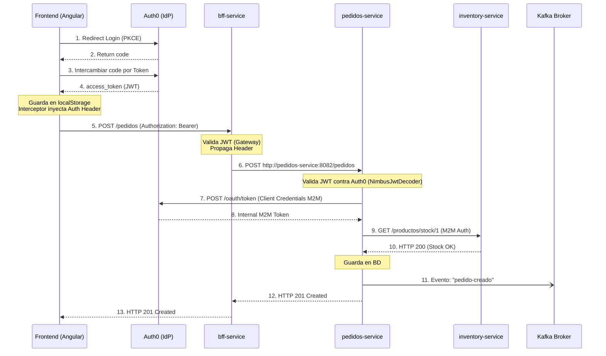

# SmartLogix - MVP

Este es el repositorio principal del proyecto SmartLogix. Contiene los microservicios core para la gestión de pedidos, inventario, envíos y usuarios.

## 🔐 CONFIGURACIÓN DE SEGURIDAD (IMPORTANTE)

### ⚠️ Credenciales y Variables de Entorno

**NUNCA** commitees credenciales reales al repositorio. Este proyecto utiliza variables de entorno para todas las credenciales sensibles.

### Paso 1: Crear Archivo .env

1. Copia el archivo `.env.example`:
```bash
cp .env.example .env
```

2. Edita `.env` y completa con tus credenciales reales de Auth0:

```bash
# Auth0 Configuration
AUTH0_DOMAIN=tu-tenant.us.auth0.com
AUTH0_AUDIENCE=https://tu-api-identifier

# M2M Application (Machine-to-Machine)
AUTH0_M2M_CLIENT_ID=tu_m2m_client_id_real
AUTH0_M2M_CLIENT_SECRET=tu_m2m_client_secret_real

# SPA Application (Single Page Application)
AUTH0_SPA_CLIENT_ID=tu_spa_client_id_real

# Database
POSTGRES_PASSWORD=cambia_esta_password_segura
```

### Paso 2: Configurar Auth0

#### Crear M2M Application (Machine-to-Machine)

1. Ve a Auth0 Dashboard → Applications → Create Application
2. Nombre: `SmartLogix M2M`
3. Tipo: **Machine to Machine Applications**
4. Selecciona tu API
5. Autoriza los siguientes permisos (scopes):
   - `read:users`
   - `create:users`
   - `update:users`
   - `read:products`
   - `create:orders`
6. Copia `Client ID` y `Client Secret` a tu `.env`:
   ```
   AUTH0_M2M_CLIENT_ID=<valor copiado>
   AUTH0_M2M_CLIENT_SECRET=<valor copiado>
   ```

#### Crear SPA Application (para el Frontend)

1. Ve a Auth0 Dashboard → Applications → Create Application
2. Nombre: `SmartLogix Frontend`
3. Tipo: **Single Page Web Applications**
4. Configura:
   - **Allowed Callback URLs**: `http://localhost:4200/auth/callback`
   - **Allowed Logout URLs**: `http://localhost:4200/auth/login`
   - **Allowed Web Origins**: `http://localhost:4200`
5. Copia `Client ID` a tu `.env`:
   ```
   AUTH0_SPA_CLIENT_ID=<valor copiado>
   ```

### Paso 3: Verificar .gitignore

El archivo `.gitignore` **debe** contener:

```
.env
.env.local
.env.*.local
```

Esto previene que tus credenciales sean commiteadas accidentalmente.

---

## 🚀 INSTALACIÓN Y EJECUCIÓN

## Flujo de Estados del Pedido y Sincronización con Envíos

La gestión de pedidos es el core del sistema. Todos los cambios de estado en un pedido se reflejan asíncronamente en el microservicio de envíos (`envio-service`) mediante eventos de Kafka.

### 1. Estados del Pedido

El ciclo de vida de un pedido está gobernado por el enumerador `EstadoPedido` (`pedidos-service`):

*   **PENDIENTE**: El pedido fue creado, el stock fue validado pero no descontado, y el usuario aún no ha realizado el pago.
*   **PAGADO**: El usuario pagó el pedido. En este estado se dispara el evento para descontar el stock en `inventory-service`.
*   **EN_PREPARACION**: El administrador ha aceptado el pedido y el almacén está preparando los productos físicos.
*   **ENVIADO**: El pedido fue entregado al operador logístico y está en tránsito hacia el cliente.
*   **ENTREGADO**: El pedido llegó a las manos del cliente final. Estado terminal exitoso.
*   **CANCELADO**: El pedido fue anulado por el usuario o administrador. Dispara reversión de stock si ya estaba pagado.

### 2. Transiciones Permitidas

Las transiciones de estado ocurren de forma estricta según las reglas de negocio implementadas en `PedidoServiceImpl` y `AdminPedidoServiceImpl`:

| Estado origen | Acción | Estado destino | Servicio / Actor |
| :--- | :--- | :--- | :--- |
| `PENDIENTE` | `pagar()` | `PAGADO` | `PedidoServiceImpl` (Usuario) |
| `PAGADO` | `preparar()` | `EN_PREPARACION` | `AdminPedidoServiceImpl` (Admin) |
| `EN_PREPARACION`| `enviar()` | `ENVIADO` | `AdminPedidoServiceImpl` (Admin) |
| `ENVIADO` | `entregar()` | `ENTREGADO` | `AdminPedidoServiceImpl` (Admin) |
| `PAGADO` | `cancelar()` | `CANCELADO` | `PedidoServiceImpl` (Usuario) |
| `EN_PREPARACION`| `cancelar()` | `CANCELADO` | `PedidoServiceImpl` (Usuario) |
| `ENVIADO` | `cancelar()` | `CANCELADO` | `PedidoServiceImpl` (Usuario) |
| `CANCELADO` | `reactivar()`| `PENDIENTE` | `PedidoServiceImpl` (Usuario) |

### 3. Integración Pedido ↔ Envío

La sincronización entre `pedidos-service` y `envio-service` ocurre 100% por Kafka de manera asíncrona (Coreografía).
El publicador siempre es el `KafkaProducerService` de `pedidos-service`.

Eventos principales:
*   **`pedido-creado`**: Consumido por `PedidoCreadoConsumer`. Indica que nació un nuevo pedido.
*   **`pedido-cancelado`**: Consumido por `PedidoCanceladoConsumer`. Fuerza la anulación de envíos en curso.
*   **`pedido-estado-actualizado`**: Consumido por `PedidoEstadoActualizadoConsumer`. Sincroniza la evolución logística del pedido.

### 4. Creación Automática de Envíos

El alta de un envío ocurre de forma transparente:
1. Usuario invoca `crearDesdeRequest()` en `pedidos-service`.
2. Se publica el evento Kafka `pedido-creado`.
3. `envio-service` consume el evento mediante `PedidoCreadoConsumer`.
4. Llama al BFF interno para obtener detalles del usuario y dirección.
5. Invoca `envioService.crearEnvio()` creando un registro con `EstadoEnvio.PENDIENTE`.

### 5. Cancelación Automática de Envíos

Si un usuario cancela un pedido, el envío debe abortarse:
1. Usuario invoca `cancelar()` en `pedidos-service`.
2. Se publica el evento Kafka `pedido-cancelado`.
3. `envio-service` consume el evento mediante `PedidoCanceladoConsumer`.
4. Invoca `envioService.cancelarPorPedido(pedidoId)`.
5. El envío pasa a `CANCELADO` **únicamente** si se encontraba en estado `PENDIENTE` o `PREPARANDO`. Si ya estaba `EN_RUTA` o `ENTREGADO`, la cancelación logística se bloquea (se mantiene el estado logístico avanzado).

### 6. Relación Entre Estados de Pedido y Envío

`envio-service` usa el patrón Strategy (`EstadoEnvioStrategyResolver`) para mapear el `EstadoPedido` entrante a su propio `EstadoEnvio`.

| Estado del Pedido (Origen) | Estado del Envío Mapeado (`EstadoEnvio`) |
| :--- | :--- |
| `PENDIENTE` | `PENDIENTE` |
| `PAGADO` | `PREPARANDO` |
| `EN_PREPARACION` | `PREPARANDO` |
| `ENVIADO` | `EN_RUTA` |
| `ENTREGADO` | `ENTREGADO` |
| `CANCELADO` | `CANCELADO` |

> Nota: Las transiciones en `envio-service` son idempotentes y de un solo sentido. El consumidor utiliza `actualEstado.level() >= nuevoEstado.level()` para prevenir retrocesos indeseados.

### 7. Diagrama Completo del Flujo

```text
Cliente (Frontend / API)
   │
   ├─ POST /pedidos (crear)
   ├─ PUT  /pedidos/{id}/pagar
   ├─ PUT  /admin/pedidos/{id}/enviar
   └─ PUT  /pedidos/{id}/cancelar
   │
   ▼
┌────────────────────────┐
│     pedidos-service    │◄─── (Validación Stock Síncrona HTTP) ─── inventory-service
│                        │
│ Pedido (PostgreSQL)    │
└──────────┬─────────────┘
           │ (Publica Eventos: pedido-creado, pedido-estado-actualizado, pedido-cancelado)
           ▼
     ┌───────────┐
     │   KAFKA   │
     └─────┬─────┘
           │ (Consume asíncronamente)
           ▼
┌────────────────────────┐
│      envio-service     │
│                        │
│ Envio (PostgreSQL)     │
└──────────┬─────────────┘
           │ Actualiza tracking y estado logístico según mapeo
           ▼
   (Consulta Estado Final BFF)
```

### 8. Limitaciones Conocidas y Deuda Técnica (Alcance MVP)

Dado que este proyecto es un MVP Académico, posee ciertas limitaciones arquitectónicas documentadas que deben tenerse en cuenta para entornos de producción reales:

1.  **Consistencia Eventual (Stock):** El cobro (`pagar()`) y el descuento de stock (`inventory-service`) operan mediante consistencia eventual. Si el Kafka falla permanentemente, el pedido queda `PAGADO` pero el stock no se descuenta.
2.  **Ausencia de Patrón Outbox/Saga:** No existe patrón Outbox para la publicación Kafka ni un orquestador Saga para transacciones distribuidas. Una falla de la JVM entre el `commit` de la BD y el `kafkaTemplate.send()` generaría pérdida de eventos.
3.  **Comportamiento de Reactivación:** La función `reactivar()` en `pedidos-service` retorna el pedido al estado `PENDIENTE`. Sin embargo, no re-valida inmediatamente el stock contra el inventario. La validación delegada ocurrirá recién cuando se intente volver a `pagar()`.
4.  **No hay Retry o DLQ configurado:** Los consumers (ej. de inventario o envíos) que fallen por excepciones transitorias o reglas de negocio loguean el error pero auto-confirman el mensaje, perdiéndolo sin reintentos automáticos ni cola de mensajes muertos (Dead Letter Queue).

---

## Arquitectura y Buenas Prácticas

### 1. Patrones de Diseño

#### 1.1 Strategy Pattern ✅ Implementado

El patrón Strategy se utiliza en `envio-service` para resolver dinámicamente el mapeo entre el estado de un pedido (`EstadoPedido`) y el estado logístico correspondiente (`EstadoEnvio`).

**Archivos involucrados:**

| Archivo | Ruta | Rol |
| :--- | :--- | :--- |
| `EstadoEnvioStrategy` | `envio-service/.../strategy/EstadoEnvioStrategy.java` | Interfaz del contrato: define `resolver()` y `aplica()` |
| `PendienteStrategy` | `envio-service/.../strategy/impl/PendienteStrategy.java` | Mapea `PENDIENTE → PENDIENTE` |
| `PagadoStrategy` | `envio-service/.../strategy/impl/PagadoStrategy.java` | Mapea `PAGADO → PREPARANDO` |
| `EnPreparacionStrategy` | `envio-service/.../strategy/impl/EnPreparacionStrategy.java` | Mapea `EN_PREPARACION → PREPARANDO` |
| `EnviadoStrategy` | `envio-service/.../strategy/impl/EnviadoStrategy.java` | Mapea `ENVIADO → EN_RUTA` |
| `EntregadoStrategy` | `envio-service/.../strategy/impl/EntregadoStrategy.java` | Mapea `ENTREGADO → ENTREGADO` |
| `CanceladoStrategy` | `envio-service/.../strategy/impl/CanceladoStrategy.java` | Mapea `CANCELADO → CANCELADO` |
| `EstadoEnvioStrategyResolver` | `envio-service/.../strategy/EstadoEnvioStrategyResolver.java` | Resuelve la estrategia correcta en tiempo de ejecución |

**¿Cómo funciona?**

1.  Cada estrategia concreta es un `@Component` de Spring que implementa `EstadoEnvioStrategy`.
2.  `EstadoEnvioStrategyResolver` recibe todas las estrategias vía inyección de dependencias (`List<EstadoEnvioStrategy>`), construye un `Map<EstadoPedido, EstadoEnvioStrategy>` interno y expone el método `resolver(EstadoPedido)`.
3.  El consumer Kafka `PedidoEstadoActualizadoConsumer` invoca al resolver para determinar dinámicamente el nuevo estado del envío cuando llega un evento `pedido-estado-actualizado`.

#### 1.2 Factory Pattern ✅ Implementado

El patrón Factory se utiliza en `pedidos-service` para centralizar la creación de todos los eventos Kafka. En lugar de construir objetos de evento directamente con `new` en los servicios, la clase `PedidoEventFactory` expone métodos estáticos de fábrica.

**Archivo principal:**

*   `pedidos-service/.../event/PedidoEventFactory.java` — Clase utilitaria con constructor privado y 4 métodos estáticos de fábrica:
    *   `estadoActualizado(Long pedidoId, String nuevoEstado)` → crea `PedidoEstadoActualizadoEvent`
    *   `cancelado(Long pedidoId)` → crea `PedidoCanceladoEvent`
    *   `creado(Long pedidoId, String usuarioId, String direccion, Double total, List<ProductoEvent> productos)` → crea `PedidoCreadoEvent`
    *   `compra(Long productoId, Integer cantidad, String usuarioId)` → crea `CompraEvent`

**Uso real:**

*   En `KafkaPedidoEstadoObserver.java`: invoca `PedidoEventFactory.creado(...)` para construir el evento de pedido creado.
*   En `PedidoServiceImpl.java`: invoca `PedidoEventFactory.compra(...)` para construir eventos de compra.

#### 1.3 Observer Pattern ✅ Implementado

El patrón Observer se utiliza en `pedidos-service` para desacoplar la lógica de negocio de pedidos de la publicación de eventos Kafka. `PedidoServiceImpl` no conoce Kafka directamente; solo interactúa con la interfaz del observer.

**Archivos involucrados:**

| Archivo | Ruta | Rol |
| :--- | :--- | :--- |
| `PedidoEstadoObserver` | `pedidos-service/.../event/PedidoEstadoObserver.java` | Interfaz: define `onEstadoCambiado()`, `onPedidoCancelado()`, `onPedidoCreado()` |
| `KafkaPedidoEstadoObserver` | `pedidos-service/.../event/KafkaPedidoEstadoObserver.java` | Implementación: publica eventos Kafka usando `PedidoEventFactory` |
| `PedidoServiceImpl` | `pedidos-service/.../service/impl/PedidoServiceImpl.java` | Cliente: inyecta `PedidoEstadoObserver` y lo invoca en cada cambio de estado |

**¿Cómo funciona?**

1.  `PedidoServiceImpl` recibe `PedidoEstadoObserver` por inyección de dependencias.
2.  En cada operación que muta el estado del pedido (`pagar()`, `cancelar()`, `crearDesdeRequest()`), invoca los métodos del observer.
3.  `KafkaPedidoEstadoObserver` implementa el observer y utiliza `PedidoEventFactory` para construir los eventos, que luego publica vía `KafkaProducerService`.

---

### 2. Observabilidad

#### 2.1 Logging ✅ Implementado

**Framework:** SLF4J + Logback (incluido transitivamente vía `spring-boot-starter-web` → `spring-boot-starter-logging`).

Los 5 microservicios usan SLF4J como fachada de logging. Tres de ellos poseen configuración personalizada de Logback (`logback-spring.xml`).

| Microservicio | `logback-spring.xml` | Logger (SLF4J) | Clases con Logger | Notas |
| :--- | :--- | :--- | :--- | :--- |
| `pedidos-service` | ✅ **JSON estructurado** (LogstashEncoder) | ✅ | `KafkaPedidoEstadoObserver`, `KafkaProducerService`, `TraceFilter` | Logs en formato JSON con campos `service`, `version` y `traceId` vía MDC. Dep: `logstash-logback-encoder:7.4` |
| `envio-service` | ✅ Texto plano | ✅ | `EnvioController`, `EnvioServiceImpl` (Lombok `@Slf4j`), `PedidoCreadoConsumer`, `PedidoCanceladoConsumer`, `PedidoEstadoActualizadoConsumer`, `InventoryClient`, `PedidoClient`, `WebClientConfig`, `TraceFilter`, `CorrelationIdFilter` | Nivel root: DEBUG. Incluye debug de `reactor.netty.http.client` |
| `bff-service` | ✅ Texto plano | ✅ | `PedidoAggregator`, `PedidoBffServiceImpl`, `CorrelationIdFilter` | Patrón incluye `correlationId` del MDC: `[corrId:%X{correlationId}]` |
| `inventory-service` | ❌ | ✅ | `KafkaConsumer`, `KafkaProducer`, `CorrelationIdFilter` | Niveles configurados en `application.properties`: `kafka=INFO`, `hibernate.SQL=DEBUG`, `security=INFO` |
| `usuarios-service` | ❌ | ❌ | — | **Sin logging implementado.** No hay imports de SLF4J, ni Logger, ni configuración alguna |

**Patrón de uso típico (4 de 5 servicios):**

```java
private static final Logger log = LoggerFactory.getLogger(NombreClase.class);
log.info("Pedido creado con id: {}", pedidoId);
log.warn("Stock insuficiente para producto: {}", productoId);
log.error("Error procesando evento Kafka: {}", mensaje);
```

**Configuración destacada — `pedidos-service` (logging más avanzado):**

El archivo `pedidos-service/src/main/resources/logback-spring.xml` utiliza `LogstashEncoder` para emitir logs en formato JSON, lo que los hace compatibles con pipelines de agregación (ELK, Loki, etc.):
*   Campos custom: `{"service": "pedidos-service", "version": "1.0.0"}`
*   Incluye `traceId` del MDC: `<includeMdcKeyName>traceId</includeMdcKeyName>`
*   Niveles: `com.smartlogix: INFO`, `org.springframework: WARN`

#### 2.2 Tracing ⚠️ Parcial (manual, sin framework estándar)

**No se utiliza ningún framework de tracing distribuido** (sin Spring Cloud Sleuth, OpenTelemetry, Zipkin ni Jaeger).

Sin embargo, **4 de 5 microservicios implementan tracing manual** basado en filtros HTTP que inyectan un ID de correlación/traza en el MDC de SLF4J:

| Microservicio | Filtro(s) | Clave MDC | Header HTTP |
| :--- | :--- | :--- | :--- |
| `bff-service` | `CorrelationIdFilter` (`bff/logs/`) | `X-Correlation-Id` | `X-Correlation-Id` |
| `envio-service` | `CorrelationIdFilter` (`envio/logs/`) + `TraceFilter` (`envio/config/`) | `traceId` | `traceId` / `X-Trace-Id` (response) |
| `inventory-service` | `CorrelationIdFilter` (`inventory/logs/`) | `correlationId` | `correlationId` |
| `pedidos-service` | `TraceFilter` (`pedidos/config/`) | `traceId` | — (no header de respuesta) |
| `usuarios-service` | ❌ Ninguno | — | — |

**Limitaciones conocidas:**
*   **Claves MDC inconsistentes** entre servicios (`X-Correlation-Id`, `traceId`, `correlationId`), lo que impide correlacionar trazas end-to-end.
*   **No existe propagación real** entre servicios: cada filtro genera su propio UUID; los headers no se reenvían en llamadas inter-servicio.
*   `envio-service` tiene **dos filtros superpuestos** (`TraceFilter` y `CorrelationIdFilter`) que ambos escriben en la clave `traceId`, lo que puede generar conflictos.

#### 2.3 Métricas ⚠️ Parcial

**4 de 5 microservicios incluyen `spring-boot-starter-actuator`** como dependencia. Sin embargo, solo `pedidos-service` tiene la integración completa con Prometheus.

| Microservicio | Actuator | Prometheus Registry | Endpoints expuestos |
| :--- | :--- | :--- | :--- |
| `pedidos-service` | ✅ | ✅ `micrometer-registry-prometheus` | `health`, `metrics`, `prometheus`, `info`, `circuitbreakers` |
| `envio-service` | ✅ | ❌ | `health`, `metrics`, `prometheus`*, `info` |
| `bff-service` | ✅ | ❌ | `health`, `info`, `metrics` |
| `inventory-service` | ✅ | ❌ | — (dependencia presente, sin configuración de endpoints) |
| `usuarios-service` | ❌ | ❌ | — (sin Actuator) |

> \* `envio-service` expone el endpoint `prometheus` en su configuración, pero **no tiene** la dependencia `micrometer-registry-prometheus`, por lo que dicho endpoint no funcionará.

**Configuración destacada — `pedidos-service` (`application.properties`):**
```properties
management.endpoints.web.exposure.include=health,metrics,prometheus,info,circuitbreakers
management.endpoint.health.show-details=always
management.metrics.export.prometheus.enabled=true
```

**No se encontraron métricas custom** (`@Timed`, `@Counted`, `MeterRegistry`) en ningún microservicio. Solo se exponen las métricas automáticas de Micrometer/Actuator.

#### 2.4 Monitoreo de Microservicios ⚠️ Parcial

**No existe infraestructura de monitoreo desplegada.** El `docker-compose.yml` no incluye Prometheus, Grafana, ELK/EFK, Loki ni ningún backend de recolección. El directorio `infrastructure/` contiene únicamente scripts SQL de inicialización.

**Health Checks en Docker Compose:** Todos los servicios tienen healthchecks básicos configurados:

| Componente | Tipo de healthcheck | Intervalo |
| :--- | :--- | :--- |
| PostgreSQL (×4) | `pg_isready -U postgres -d postgres` | 5s, 12 reintentos |
| Zookeeper | `cub zk-ready localhost:2181 40` | 10s, 8 reintentos |
| Kafka | `kafka-broker-api-versions --bootstrap-server localhost:9092` | 10s, 12 reintentos |
| Microservicios (×5) | TCP port check: `exec 3<>/dev/tcp/127.0.0.1/{port}` | 15s |

> ⚠️ Los healthchecks de los microservicios son verificaciones TCP básicas (puerto abierto), **no utilizan** los endpoints `/actuator/health` de Spring Boot Actuator que sí están disponibles en 4 de los 5 servicios.

---

### Resumen de Observabilidad

| Pilar | Estado | Detalle |
| :--- | :--- | :--- |
| **Logging** | ✅ Implementado | SLF4J + Logback en 4/5 servicios. `pedidos-service` con logs JSON (LogstashEncoder). `usuarios-service` sin logging. |
| **Tracing** | ⚠️ Parcial | Filtros MDC manuales en 4/5 servicios, pero con claves inconsistentes y sin propagación real. Sin Sleuth/OpenTelemetry/Zipkin. |
| **Métricas** | ⚠️ Parcial | Actuator en 4/5 servicios. Solo `pedidos-service` con Prometheus completo. Sin métricas custom. |
| **Monitoreo** | ⚠️ Parcial | Healthchecks Docker (TCP) en todos los servicios. Sin Prometheus/Grafana/ELK desplegado como infraestructura. |

---

## Arquitectura del Sistema (Arquetipos)
# SmartLogix - Sistema de Logística y Envíos

SmartLogix es una plataforma robusta de microservicios diseñada para gestionar el ciclo de vida completo de pedidos, inventario, logística y envíos, respaldada por un Frontend en Angular.

## 🏗 Arquitectura del Sistema (Flujo Real)

El proyecto utiliza un ecosistema maduro de patrones de diseño y arquitecturas modernas:

### 1. Arquitectura Frontend (Angular)
El frontend de SmartLogix está construido sobre **Angular (Standalone Components)**.
*   **Routing Strategy**: Utiliza **PathLocationStrategy** (rutas HTML5 estándar sin el símbolo `#`), definidas mediante Lazy Loading en `app.routes.ts`.
*   **Gestión de Autenticación**: El login delega completamente la seguridad en Auth0 mediante el flujo **Authorization Code con PKCE**.
    *   Una vez que el usuario ingresa sus credenciales en el Universal Login de Auth0, es redirigido a `/auth/callback`.
    *   El `AuthService` intercambia el código por un `access_token` y un `refresh_token`, los cuales almacena de forma segura en `localStorage`.
    *   El `auth.interceptor.ts` se encarga de inyectar automáticamente el header `Authorization: Bearer <token>` en absolutamente todas las peticiones HTTP (salvo rutas públicas predefinidas).
*   **Comunicación HTTP**: Angular se comunica **exclusivamente con el BFF**. Utiliza el `BffService` para resolver la URL base (`http://localhost:8080`). Las rutas de consumo son **absolutas** (`/pedidos`, `/catalogo/productos`), **no utilizan el prefijo genérico `/api/*`**, lo cual asegura una consistencia 1-a-1 con los controladores del BFF.

### 2. Backend for Frontend (BFF)
El servicio `bff-service` (Spring Boot WebFlux) actúa como **API Gateway y Agregador**:
*   Recibe la petición del frontend (ej: `GET http://localhost:8080/pedidos`).
*   Su `WebClientConfig` extrae el RAW JWT proveniente del cliente e inyecta dinámicamente este mismo token en los headers de las peticiones que enruta hacia los microservicios internos.
*   También funciona como fachada para componer datos de múltiples servicios (Patrón API Composition).

### 3. Arquitectura de Microservicios (Backend)
El core de negocio se distribuye en dominios autónomos (`pedidos-service`, `envio-service`, `inventory-service`, `usuarios-service`):
*   Cada servicio tiene su propia Base de Datos PostgreSQL, garantizando el desacoplamiento de los datos.
*   Validan el token propagado desde el BFF **directamente contra Auth0** (`NimbusJwtDecoder`).
*   **M2M (Machine-to-Machine)**: Cuando un microservicio requiere datos de otro síncronamente (ej: `pedidos` llamando a `inventory`), su `WebClient` utiliza `OAuth2 Client Credentials` para negociar un token interno con Auth0 transparente al usuario.

### 4. Arquitectura Orientada a Eventos
Para flujos que no requieren respuesta inmediata (Coreografía):
*   Spring Kafka propaga eventos de dominio asíncronos (ej. `pedido-creado`).
*   El `envio-service` actúa como consumidor (`@KafkaListener`) reaccionando a las ventas cerradas sin acoplamiento HTTP directo.

---

## 🔁 Diagrama de Flujo de Ejecución (End-to-End)



---

## 🧩 Patrones de Diseño Aplicados en Código

*   **Strategy**: Interfaz `CostoEnvioStrategy` e implementaciones (`CostoEnvioEstandar`, `CostoEnvioExpress`). Elegidos dinámicamente según el tipo de envío en `EnvioServiceImpl`.
*   **Factory**: `PedidoEventFactory` genera DTOs de eventos inmutables basados en operaciones de la BD.
*   **Observer**: `PedidoEstadoObserver` reacciona pasivamente a transiciones de estado de `Pedido`.
*   **Client Pattern**: Clases como `InventoryClient` que encapsulan e inyectan el `WebClient`, el `CircuitBreaker` y el manejo de JWT M2M para aislar los detalles HTTP del Service Layer.
*   **Facade / Aggregator**: `PedidoAggregator` en el BFF compone llamados asíncronos a múltiples clientes de microservicios para armar un DTO consolidado al frontend.

---

## Patrones de Diseño Adicionales en el Código


### 1. Client Pattern (REST Clients)
* **Dónde se aplica:** Clases `PedidoClient`, `UsuarioClient`, `InventoryClient` en los servicios.
* **Justificación:** Abstrae la complejidad de configuración de `WebClient` y de las peticiones HTTP M2M, encapsulando las rutas y métodos en una interfaz concreta para que el servicio principal (como `EnvioServiceImpl`) no maneje URLs.
* **Ejemplo real (`envio-service/src/main/java/com/smartlogix/envio/client/PedidoClient.java`):**
```java
public PedidoResponse obtenerPedido(String pedidoId) {
    return webClient.get()
            .uri("http://pedidos-service:8082/internal/pedidos/" + pedidoId)
            .retrieve()
            .bodyToMono(PedidoResponse.class)
            .block();
}
```

### 2. Facade Pattern
* **Dónde se aplica:** Controladores del BFF (ej. `PedidoBffController.java` y `EnvioBffController.java`).
* **Justificación:** El controlador actúa como una fachada que provee una interfaz unificada y simplificada al exterior, orquestando internamente validaciones, extracción de tokens del `SecurityContextHolder` y ruteo hacia múltiples microservicios, ocultando toda esa complejidad del consumidor HTTP final.

---

## Flujo Real de Ejecución (BFF → Microservicios → Kafka → Auth0)

Con base en la verificación de logs en tiempo de ejecución, el ciclo de vida real de un request interactuando con toda la arquitectura y seguridad M2M es el siguiente:

1. **Ingreso (BFF):** El cliente realiza un request HTTP al BFF (ej. `POST /api/envios`) enviando su token de sesión (`Authorization: Bearer <jwt_usuario>`).
2. **Propagación Automática (BFF → Microservicio):** El BFF, mediante un interceptor `ExchangeFilterFunction` configurado en `WebClientConfig.java`, extrae automáticamente el JWT del `SecurityContext` y lo inyecta en el WebClient. El BFF rutea el request hacia la red interna de Docker llamando a `http://envio-service:8084/api/envios`.
3. **M2M Flow (Microservicio → Auth0):** Al recibir la petición, `envio-service` valida el JWT del usuario. Sin embargo, su lógica de negocio necesita comunicarse con `pedidos-service`. Como el `WebClient` de `envio-service` está configurado con OAuth2 `client_credentials`, interrumpe temporalmente la operación y envía un request `POST /oauth/token` a **Auth0** usando el `client-id` y `client-secret` de su `application.properties`.
4. **Llamada Interna Segura (Microservicio → Microservicio):** Auth0 valida las credenciales y devuelve un **HTTP 200 OK** con un `access_token` M2M. `envio-service` inyecta este nuevo token y ejecuta satisfactoriamente el request hacia `http://pedidos-service:8082/internal/pedidos/{id}`.
5. **Propagación Asíncrona (Microservicios → Kafka):** Como resultado de las operaciones y los cambios de estado, `pedidos-service` genera y publica eventos como `pedido-estado-actualizado` hacia Kafka. `envio-service`, suscrito a estos tópicos, recibe el mensaje de forma asíncrona y sincroniza su estado logístico local de forma eventual, cerrando el ciclo arquitectónico.
